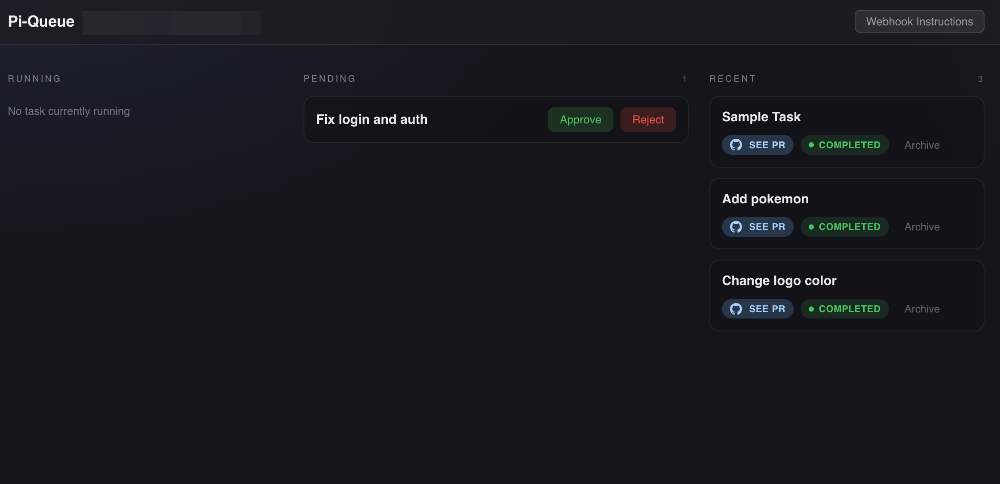
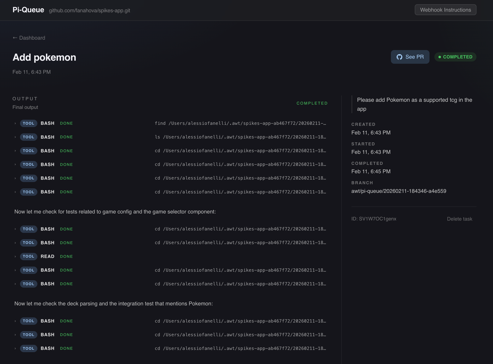

# pi-queue

`pi-queue` is a lightweight task runner for the [pi](https://github.com/mariozechner/pi-coding-agent) coding agent. It accepts tasks through a webhook, shows them in a dashboard for human approval, then lets `pi` execute each approved task in an isolated git worktree managed by [awt](https://github.com/Kernel-Labs-AI/awt).






## How it works

1. **Receive** — External tools (Linear, GitHub, Slack, etc.) submit tasks via `POST /api/tasks` with a bearer token
2. **Review** — Tasks appear as "pending" in the web dashboard for human review
3. **Approve** — A human approves (or rejects) each task from the dashboard
4. **Execute** — A background worker picks up approved tasks, creates an isolated git worktree via [`awt`](https://github.com/Kernel-Labs-AI/awt), and runs [`pi`](https://github.com/mariozechner/pi-coding-agent) with the task prompt
5. **Deliver** — On completion, `awt` pushes the branch and creates a PR

## Quick Start

### Local development

```bash
# Install dependencies
npm install

# Copy and configure environment
cp .env.example .env
# Edit .env
# Minimum required: WEBHOOK_SECRET, API_ACCESS_TOKEN, DASHBOARD_USER, DASHBOARD_PASSWORD

# Run database migrations
npm run db:migrate  # optional; schema is also created on startup when needed

# Start dev server (auto-reloads)
npm run dev
```

The dashboard is at `http://localhost:3000`.

### Docker

```bash
cp .env.example .env
# Edit .env with your values
docker compose up --build
```

### Deploy to Fly.io

See [DEPLOYMENT.md](DEPLOYMENT.md) for full instructions. I picked Fly.io because it provides a public URL without needing to buy a custom domain.

```bash
cp .env.example .env
# Fill in GIT_REPO_URL, WEBHOOK_SECRET, API_ACCESS_TOKEN, DASHBOARD_USER, DASHBOARD_PASSWORD
# Optional: set PUBLIC_ORIGIN for custom domains, or we'll infer the fly.io URL automatically from the app name
./scripts/deploy.sh
```

## API

`POST /api/tasks` is protected by `Authorization: Bearer <WEBHOOK_SECRET>`.
All other `/api/*` endpoints require either:
- `Authorization: Bearer <API_ACCESS_TOKEN>`
- or dashboard basic auth credentials (`DASHBOARD_USER` / `DASHBOARD_PASSWORD`)
The server exits at startup if `DASHBOARD_USER`, `DASHBOARD_PASSWORD`, or `API_ACCESS_TOKEN` is missing.
State-changing admin routes also enforce same-origin `Origin`/`Referer` checks.

### `POST /api/tasks`

Create a new task. Requires `Authorization: Bearer <WEBHOOK_SECRET>`.
Input is validated with bounded sizes (`title`, `prompt`, `source`, `externalId`, and `metadata` byte size).

```json
{
  "title": "Fix login validation",
  "prompt": "The login form accepts empty passwords. Fix the validation in src/auth.ts.",
  "priority": 1,
  "source": "linear",
  "externalId": "LIN-456"
}
```

Returns `201`:
```json
{ "id": "abc123", "status": "pending" }
```

### `GET /api/tasks`

List tasks. Requires API auth (bearer token or dashboard basic auth).
Optional query params: `status`, `limit`, `offset`.
`limit` and `offset` are bounded by server caps.

### `GET /api/tasks/:id`

Get full task details including output. Requires API auth.

### `GET /api/tasks/:id/events`

Get the raw captured RPC/tool event stream for a task. Requires API auth.

### `POST /api/tasks/:id/approve`

Approve a pending task for execution.

### `POST /api/tasks/:id/reject`

Reject a pending task. Optional body: `{ "reason": "..." }`.

### `DELETE /api/tasks/:id`

Delete a non-running task.

## Configuration

There are lots of presets for length, etc since the point of the API is to be public facing. 

| Variable | Required | Default | Description |
|---|---|---|---|
| `WEBHOOK_SECRET` | Yes | — | Bearer token for the webhook endpoint |
| `API_ACCESS_TOKEN` | Yes | — | Bearer token for non-webhook `/api/*` endpoints |
| `PUBLIC_ORIGIN` | Conditionally | auto from `FLY_APP_NAME` on Fly | Canonical app origin for same-origin checks (set this for custom domains or non-Fly production) |
| `ANTHROPIC_API_KEY` | No | — | API key for pi agent (or use `pi /login` through ssh once, and it will be persisted) |
| `DASHBOARD_USER` | Yes | — | Basic auth username for dashboard |
| `DASHBOARD_PASSWORD` | Yes | — | Basic auth password for dashboard |
| `API_MAX_PAGE_SIZE` | No | `100` | Max `limit` for `GET /api/tasks` |
| `API_MAX_OFFSET` | No | `10000` | Max `offset` for `GET /api/tasks` |
| `API_MAX_TITLE_LENGTH` | No | `200` | Max task title length |
| `API_MAX_PROMPT_LENGTH` | No | `20000` | Max task prompt length |
| `API_MAX_SOURCE_LENGTH` | No | `64` | Max source label length |
| `API_MAX_EXTERNAL_ID_LENGTH` | No | `128` | Max external ID length |
| `API_MAX_REJECT_REASON_LENGTH` | No | `1000` | Max reject reason length |
| `API_MAX_METADATA_BYTES` | No | `16384` | Max serialized metadata size in bytes |
| `PORT` | No | `3000` | Server port |
| `HOST` | No | `0.0.0.0` | Server bind address |
| `REPO_PATH` | No | `cwd` | Path to the git repo the agent works on |
| `DATABASE_PATH` | No | `./data/pi-queue.db` | SQLite database path |
| `PI_BINARY` | No | `pi` | Path to pi binary |
| `GIT_REPO_URL` | No | — | Repository URL to clone on first boot (used by `start.sh` and Fly deployments) |
| `TASK_TIMEOUT_MS` | No | `600000` | Max task execution time (ms) |
| `DEFAULT_PRIORITY` | No | `0` | Default priority for new tasks |
